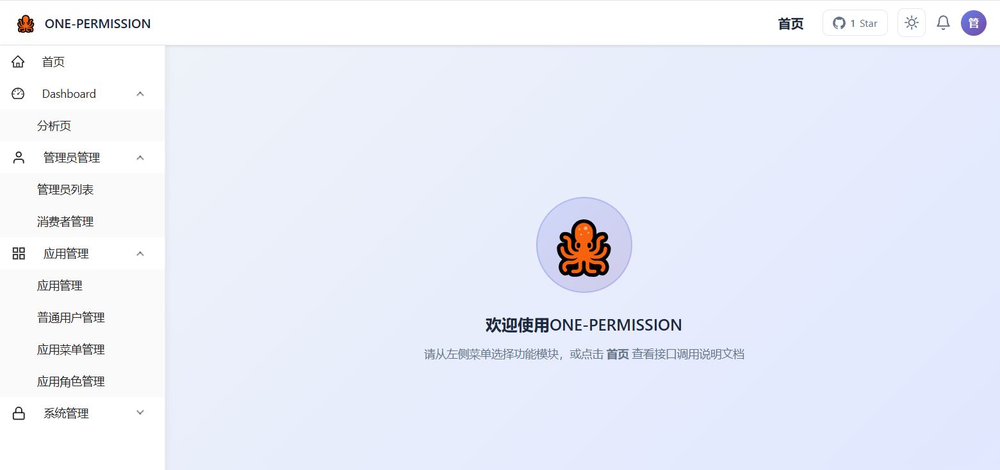
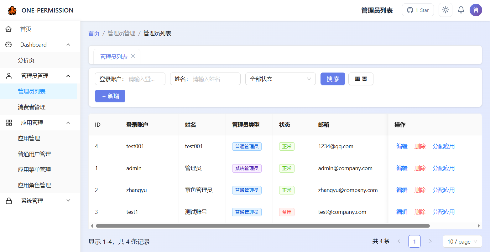
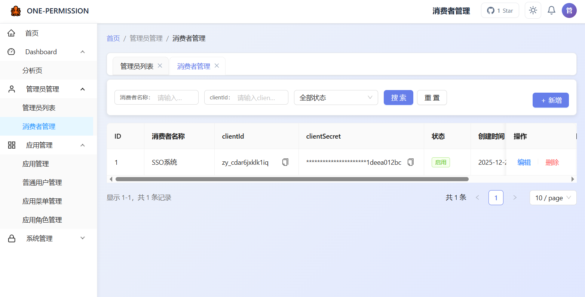
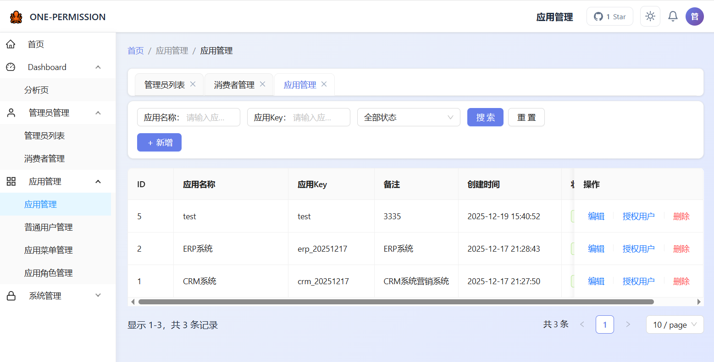
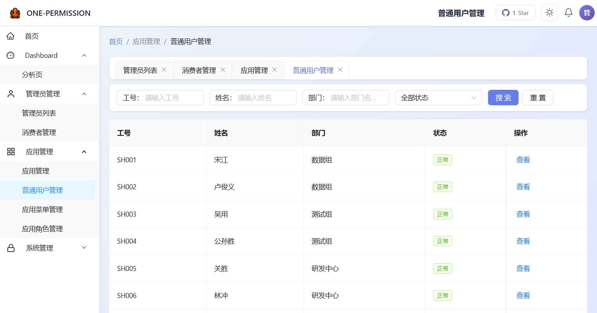
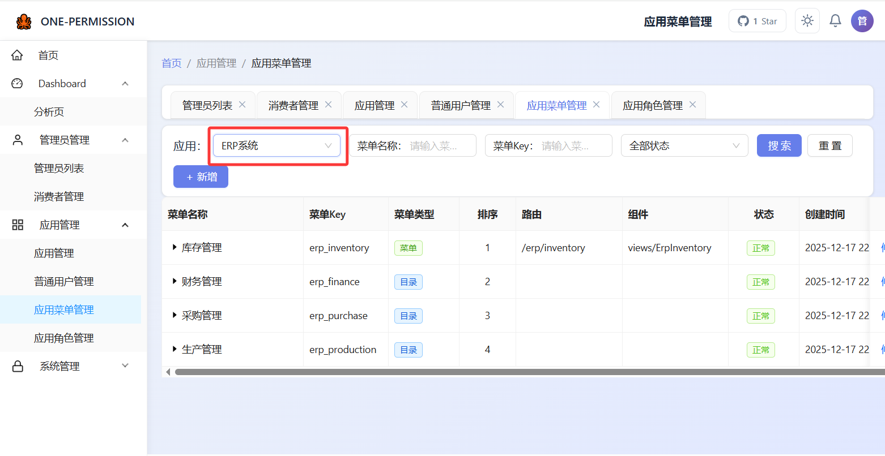
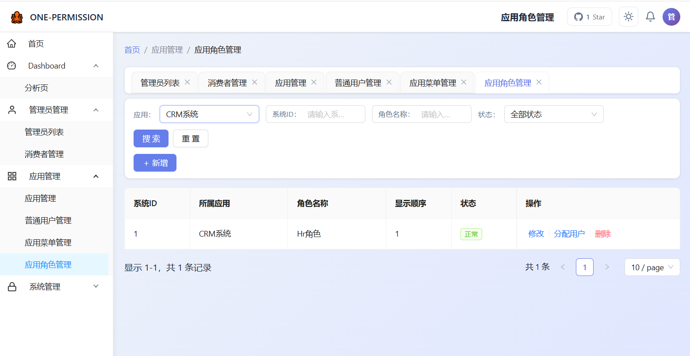

# ONE-PERMISSION 权限管理系统

## 📖 项目简介

**ONE-PERMISSION** 是一套面向中小企业和个人开发者的统一权限管理系统，用于集中管理多个业务系统的账号、角色、菜单和权限。  
系统采用前后端分离架构，提供可视化的后台管理界面，帮助你快速搭建「登录用户 + 应用 + 菜单 + 角色 + 授权」的完整权限闭环。

## 📦 适用场景

- 企业内部有多套业务系统，需要统一做权限管理
- 个人开发者希望快速搭建一套「账号 + 菜单 + 角色 + 权限 + 授权」的完整体系
- 希望统一出口向外部系统暴露权限查询接口
- 希望通过一个通用后台来管理「应用、菜单、角色、用户、部门」等权限元素

## 🎯 能做什么？

- **统一账号管理**：集中管理管理员账号、普通业务用户账号
- **统一应用管理**：支持接入多个业务系统，为不同系统独立管理菜单和角色
- **统一菜单管理**：以树形结构配置应用菜单，支持目录 / 菜单 / 按钮多种类型
- **统一角色管理**：为应用配置业务角色，并绑定菜单权限
- **统一授权管理**：
  - 按用户授权：为指定用户分配角色
  - 按部门授权：为整个部门批量分配角色
- **统一外部查询**：为外部系统提供接口，根据「应用 + 工号」查询在该应用下可访问的菜单权限
- **可视化统计**：在 Dashboard 中查看应用数量、管理员数量、在线用户数等统计信息

## 🧩 核心功能模块

### 1. Dashboard 分析页

- 展示系统中应用数量、管理员数量、在线用户数等核心指标
- 根据管理员类型（系统管理员 / 普通管理员）自动做数据权限过滤

### 2. 管理员管理

- 管理「登录后台的管理员账号」
- 支持：
  - 管理员列表查询、分页
  - 创建 / 编辑 / 删除管理员
  - 设置管理员类型（系统管理员 / 普通管理员）
  - 为管理员分配可访问的应用

### 3. 应用管理

- 管理接入到 ONE-PERMISSION 的业务系统（应用）
- 支持：
  - 应用列表管理（名称、Key、备注、状态等）
  - 为应用配置菜单、角色
  - 为应用分配普通用户的访问权限

#### 3.1 普通用户管理

- 展示业务侧普通用户（如员工、客户等）
- 仅支持「查询和查看详情」，不支持新增 / 删除
- 普通用户数据以水浒传人物作为示例初始化数据

#### 3.2 应用菜单管理

- 为某个应用配置菜单树
- 菜单支持三种类型：
  - 目录：仅用于分组
  - 菜单：具体页面
  - 按钮：页面上的操作粒度权限
- 可配置：
  - 上级菜单、菜单名称、图标、显示排序
  - 路由地址、组件路径
  - 是否外链、内嵌 URL
  - 显示状态、启用状态

#### 3.3 应用角色管理

- 为应用创建业务角色（如「HR管理员」「审批人」「只读用户」等）
- 支持：
  - 角色列表管理（系统ID、所属应用、角色名称、排序、状态等）
  - 为角色绑定菜单权限（选择菜单树，自动处理父子级勾选与半选）
  - 为角色分配用户 / 部门

#### 3.4 角色用户与部门分配

- **按用户分配**：
  - 从可选用户列表中，将用户加入某个应用角色
  - 已分配用户不会再次出现在可选列表中
  - 支持批量取消授权
- **按部门分配**：
  - 从部门树中选择部门，将整个部门的用户加入角色
  - 已分配的部门在列表中展示，可单个或批量取消授权

### 4. 系统管理（系统管理员专属）

- **系统角色管理**：管理系统级角色，用于控制后台菜单访问
- **系统菜单管理**：管理系统本身的后台菜单结构（如「Dashboard」「管理员管理」「应用管理」「系统管理」等）

### 5. 外部接口能力

系统支持为外部应用暴露统一的权限查询能力（示例能力，包括但不限于）：

- 外部系统通过 `clientId + clientSecret` 获取访问令牌
- 拿到令牌后，可根据「应用ID + 工号」查询该用户在该应用下的菜单权限
- 使用 Sa-Token 区分「后台管理员登录」和「外部消费者登录」，互不干扰

> 外部接口的详细参数、示例和调用流程，请参考后端项目中的专用文档。

## 👤 管理员类型与可见范围

- **系统管理员**
  - 可以看到所有菜单模块（Dashboard、管理员管理、应用管理、系统管理）
  - 可以管理所有应用、所有管理员、所有权限数据
  - Dashboard 统计不做数据权限过滤

- **普通管理员**
  - 只显示「应用管理」相关菜单
  - 只能管理自己被授权的应用及其菜单、角色、用户
  - Dashboard 和列表数据都会按授权应用做数据过滤

## 🎮 在线体验

- **体验地址**：`http://onepermission.zhangyuxingqiu.com/`
- **体验账号**：`admin / 123456`
- **身份类型**：系统管理员

> 该体验环境部署在个人服务器上，仅供学习与功能体验使用，请轻点操作，避免造成不必要的压力 🙏

## 📚 更多说明

- 前端实现、技术栈、启动方式等，请查看：`permission-front/README.md`
- 后端实现、数据库设计、接口说明等，请查看：`permission-backend/README.md`

## 👥 贡献与交流

- **项目作者**：章鱼
- **GitHub 项目地址**：`https://github.com/kiduo09/one-permission`
- **问题反馈**：欢迎在 GitHub Issue 中提交 Bug 或需求
- **QQ 交流群**：`1034408170`
- **微信公众号**：攻城狮小章鱼（可在项目中查看二维码）

欢迎 Star、Fork 本项目，一起完善这套权限管理系统 🎉

